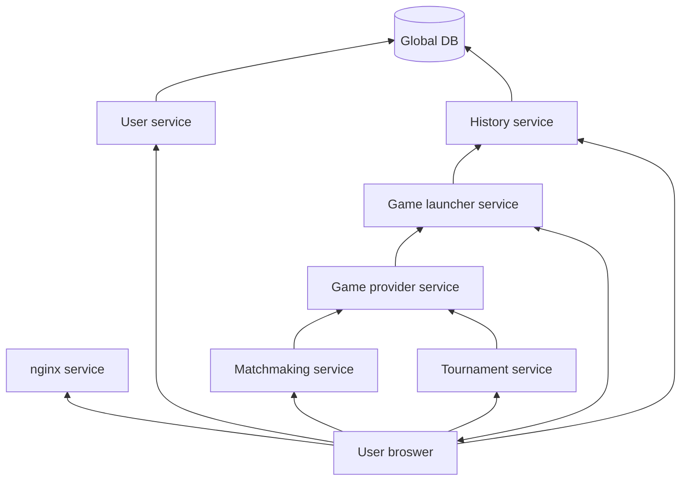
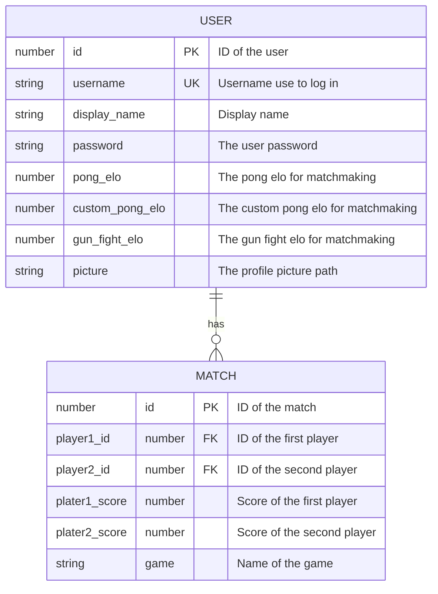

# Transcendence

## Project Infrastructure

```mermaid
flowchart BT
	browser["User broswer"]
	nginx["nginx service"]
	user["User service"]
	globalDB[(Global DB)]
	matchmaking["Matchmaking service"]
	gameProvider["Game provider service"]
	gameLauncher["Game launcher service"]
	history["History service"]
	tournament["Tournament service"]
  browser --> nginx
  browser --> user
  user --> globalDB
  browser --> matchmaking
  matchmaking --> gameProvider
  gameProvider --> gameLauncher
  browser <--> gameLauncher
  gameLauncher --> history
  history --> globalDB
  browser --> history
  browser --> tournament
  tournament --> gameProvider
```

## DB Entities relationship

```mermaid
erDiagram
	USER {
		number id PK "ID of the user"
		string username UK "Username use to log in"
		string display_name "Display name"
		string password "The user password"
		number pong_elo "The pong elo for matchmaking"
		number custom_pong_elo "The custom pong elo for matchmaking"
		number gun_fight_elo "The gun fight elo for matchmaking"
		string picture "The profile picture path"
	}
	
	MATCH {
		number id PK "ID of the match"
		player1_id number FK "ID of the first player"
		player2_id number FK "ID of the second player"
		plater1_score number "Score of the first player"
		plater2_score number "Score of the second player"
		string game "Name of the game"
	}
	
	USER ||--o{ MATCH : has
```
