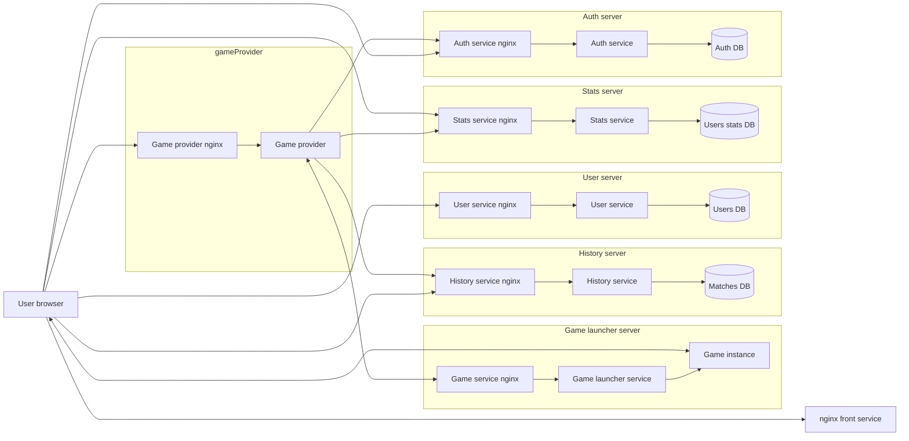
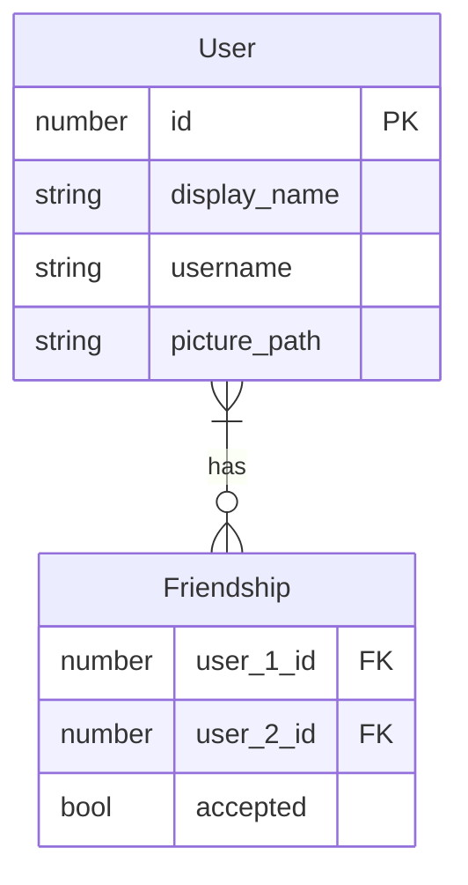
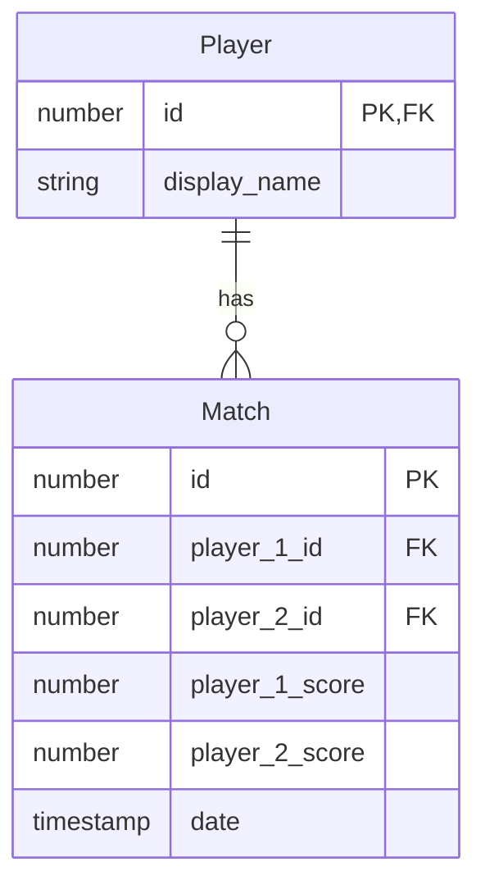
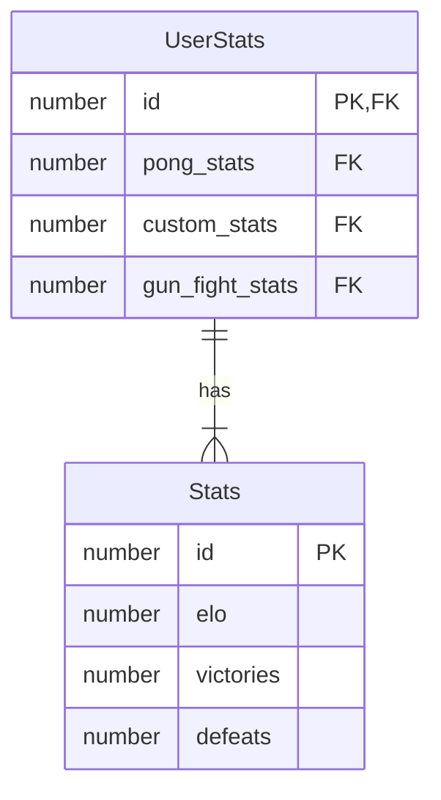
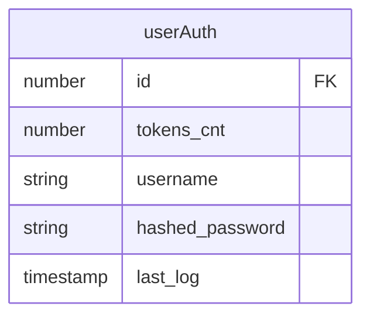

# Transcendence

## Project Infrastructure

```mermaid
flowchart LR
	nginxFront["nginx front service"]
	browser["User browser"]
	subgraph pongLauncher["Game launcher server"]
        gameInstance["Game instance"]
	    gameLauncherService["Game launcher service"]
        gameLauncherNginx["Game service nginx"]
	end
    subgraph history["History server"]
        historyNginx["History service nginx"] -->
	    historyService["History service"] -->
	    matchDB[(Matches DB)]
    end
    subgraph user["User server"]
        userNginx["User service nginx"] -->
        userService["User service"] -->
	    userDB[(Users DB)]
    end
    subgraph stats["Stats server"]
	    statsNginx["Stats service nginx"] -->
	    statsService["Stats service"] -->
	    statsDB[(Users stats DB)]
    end
    subgraph auth["Auth server"]
        authNginx["Auth service nginx"] -->
        authService["Auth service"] -->
        authDB[(Auth DB)]
    end
    subgraph gameProvider
	    gameProviderService["Game provider"]
	    gameProviderNginx["Game provider nginx"]
    end
    browser ----------> nginxFront
    browser ---> gameProviderNginx
    gameProviderService ----> historyNginx & authNginx
    browser ---> statsNginx  & historyNginx & authNginx
    browser -------> userNginx
    browser <--> gameInstance
    gameLauncherNginx --> gameLauncherService --> gameInstance
    gameProviderService <----> gameLauncherNginx
    gameProviderNginx --> gameProviderService
    gameProviderService ----> statsNginx
	  
```

## DB Entities relationship

<h3>User DB</h3>

```mermaid
erDiagram
    User {
        number id PK
        string display_name
        string username
        string picture_path
    }

    Friendship {
        number user_1_id FK
        number user_2_id FK
        bool accepted
    }

    User }|--o{ Friendship: has
```

<h3>History DB</h3>

```mermaid
erDiagram
    Match {
        number id PK
        number player_1_id FK
        number player_2_id FK
        number player_1_score
        number player_2_score
        timestamp date
    }

    Player {
        number id PK, FK
        string display_name
    }

    Player ||--o{ Match: has
```

<h3>Stats DB</h3>

```mermaid
erDiagram
    UserStats {
        number id PK, FK
        number pong_stats FK
        number custom_stats FK
        number gun_fight_stats FK
    }

    Stats {
        number id PK
        number elo
        number victories
        number defeats
    }

    UserStats ||--|{ Stats :has
```

<h3>Auth DB</h3>

```mermaid
erDiagram
    userAuth {
        number id FK
        number tokens_cnt
        string username
        string hashed_password
        timestamp last_log
    }
```

